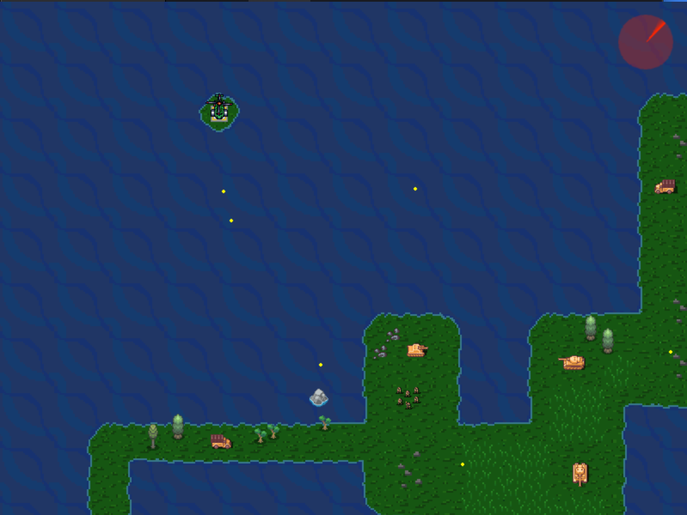
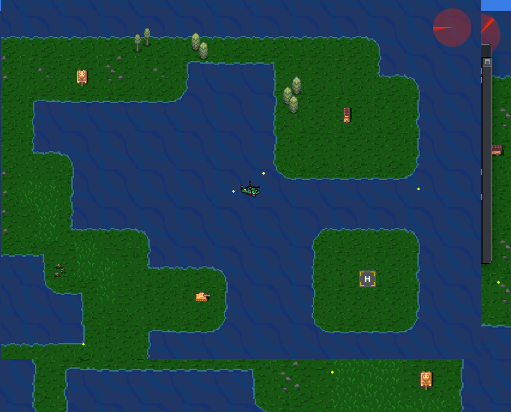

### Simple 2D game using C/C++ for Unix based OS using Lua and Simple DirectMedia Layer
#### The project was created in order to practice theoretical knowledge in Object Oriented Design

*Initial State:*

*Moving to next airstrip without being shot:*

