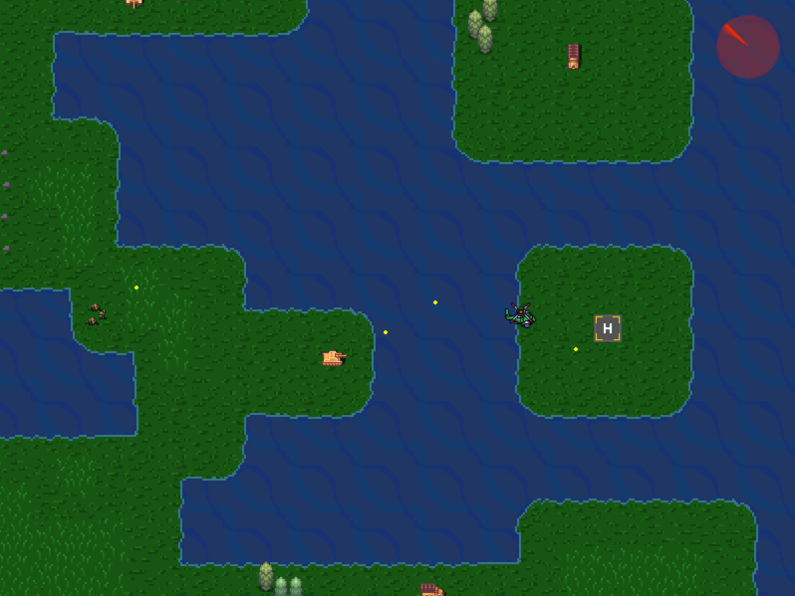

### Simple 2D game using C/C++ for Unix based OS (Linux, MacOS)
#### Requires Lua and SDL(mixer, ttf and image) installed on your platform
##### If you have it installed, follow simple steps:
##### 1) Download 2d-game directory
##### 2) Move to directory in cmd and type: "make" - to compile all the files.
##### 3) Type "make run" - to run the game.

##### 4) Use 'w', 'd', 's', 'a' to move helicopter around, land it on next airstrip without being shot down
*Initial State:*

*Moving to next airstrip:*

